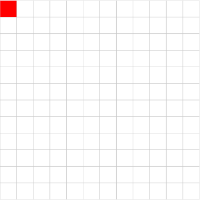
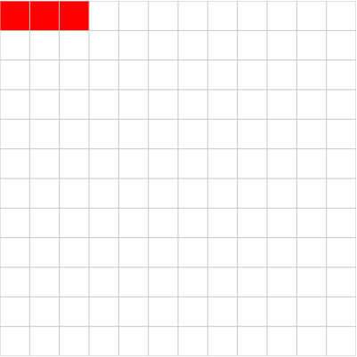
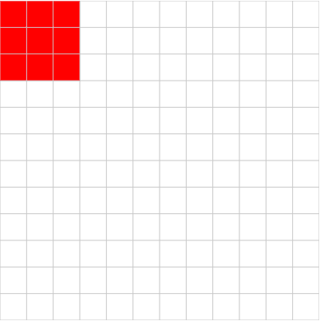

# Pixels Syntax

## Expressions
The simplest **expression** is just a colour code; for example, this program draws a single red pixel in the top left corner:

```
r
```


Multiple expressions can be given on a single line. Just put a space between them! This program draws three red pixels:

```
r r r
```


We can shorten this program, though, by specifying a number in front of the colour code. This program is equivalent to the one above:

```
1r 1r 1r
```

The shortened version looks like this:

```
3r
```

The semicolon (`;`) can be used to end a line. Any expressions after a semicolon will be drawn on a new line. For example, this program draws a 3x3 red square in the top left corner:

```
3r; 3r; 3r;
```


To make your code easier to read, though, you'll probably want to format it like this:

```
3r;
3r;
3r;
```

## Loops
Using numbered expressions is already a kind of loop, but there is syntax for more advanced loops. Take this program, for example:

```
2r 2y 2r 2y 2r 2y;
```

Here, the program `2r 2y` is repeated three times. This program does exactly that:

```
3[2r 2y];
```

The resulting picture looks like this:

![3[3r 3y]](red-and-yellow-row.png)

Looping can be done over multi-line programs as well. For example, this program is really expressing a multi-line loop:

```
r y;
r y;
r y;
```

![3[r y;]](red-and-yellow-columns.png)

Using the looping syntax, it can be rewritten like this:

```
3[r y;]
```
